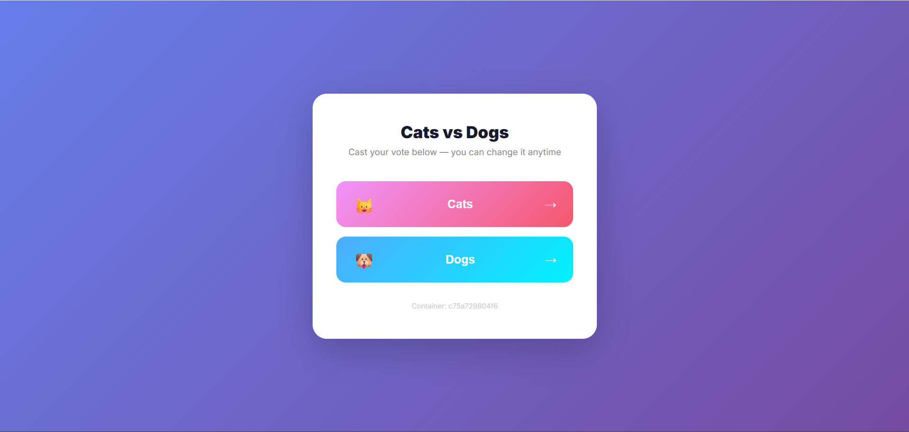
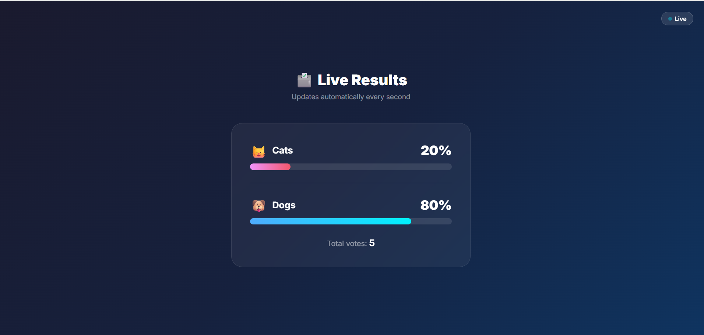
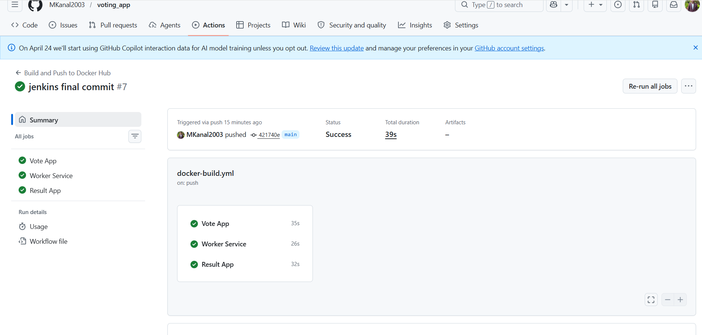
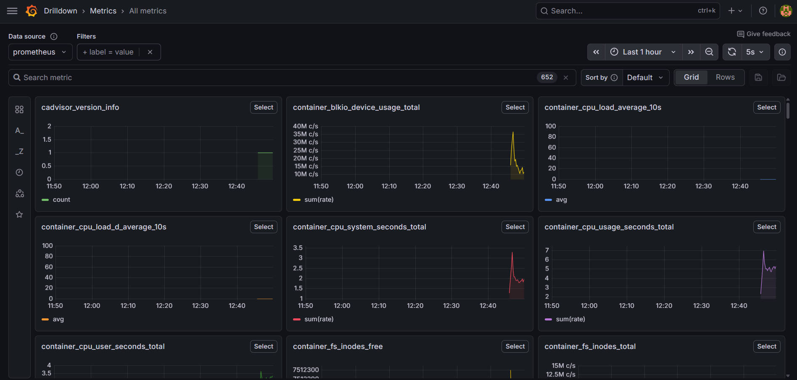

<div align="center">

```
██╗   ██╗ ██████╗ ████████╗██╗███╗   ██╗ ██████╗      █████╗ ██████╗ ██████╗ 
██║   ██║██╔═══██╗╚══██╔══╝██║████╗  ██║██╔════╝     ██╔══██╗██╔══██╗██╔══██╗
██║   ██║██║   ██║   ██║   ██║██╔██╗ ██║██║  ███╗    ███████║██████╔╝██████╔╝
╚██╗ ██╔╝██║   ██║   ██║   ██║██║╚██╗██║██║   ██║    ██╔══██║██╔═══╝ ██╔═══╝ 
 ╚████╔╝ ╚██████╔╝   ██║   ██║██║ ╚████║╚██████╔╝    ██║  ██║██║     ██║     
  ╚═══╝   ╚═════╝    ╚═╝   ╚═╝╚═╝  ╚═══╝ ╚═════╝     ╚═╝  ╚═╝╚═╝     ╚═╝    
```

# 🗳️ Distributed Voting Application — Full DevOps Project

[](https://hub.docker.com)
[](https://kubernetes.io)
[](https://github.com/features/actions)
[](https://python.org)
[](https://nodejs.org)
[](https://dotnet.microsoft.com)
[](https://redis.io)
[](https://postgresql.org)
[](https://prometheus.io)
[](https://grafana.com)

<br/>

> A **production-grade**, end-to-end DevOps implementation of a real-time distributed voting application.  
> Built with 5 microservices, fully containerized, orchestrated, monitored, and automated.

<br/>

[🚀 Quick Start](#-quick-start) • [🏗️ Architecture](#️-architecture) • [⚙️ Tech Stack](#️-tech-stack) • [🐳 Docker Hub](#-docker-hub-images) • [☸️ Kubernetes](#️-kubernetes-deployment) • [📊 Monitoring](#-monitoring) • [🔄 CI/CD](#-cicd-pipeline)

</div>

---

## ✨ What is this project?

This is a **fully distributed, real-time voting application** where users vote between two options and results update live in the browser — without any page refresh.

The project is a complete DevOps implementation covering:

- ✅ **Microservices architecture** with 5 independent services
- ✅ **Docker** containerization for every service
- ✅ **Docker Compose** for local orchestration
- ✅ **Kubernetes** for production-grade deployment
- ✅ **GitHub Actions** CI/CD pipeline — auto-build and push on every commit
- ✅ **Prometheus + Grafana** monitoring stack
- ✅ **Redis** as a high-speed message queue
- ✅ **PostgreSQL** for persistent vote storage
- ✅ **Health checks** and automatic service recovery

---

## 🏗️ Architecture

```
                        ┌─────────────────────────────────────────────────────┐
                        │                  front-tier network                  │
  ┌──────────┐          │   ┌─────────────────┐     ┌──────────────────────┐  │
  │  Browser │──────────┼──▶│   Vote App      │     │    Result App        │  │
  │  :8080   │          │   │  Python / Flask │     │  Node.js + Socket.io │  │
  └──────────┘          │   └────────┬────────┘     └──────────┬───────────┘  │
                        │            │                          │              │
  ┌──────────┐          │            │          ┌───────────────┘              │
  │  Browser │──────────┼────────────┼──────────┤                              │
  │  :8081   │          │            │          │                              │
  └──────────┘          └────────────┼──────────┼──────────────────────────────┘
                                     │          │
                        ┌────────────┼──────────┼──────────────────────────────┐
                        │            │  back-tier network                      │
                        │    ┌───────▼──────┐   │                             │
                        │    │    Redis     │   │                             │
                        │    │  (Queue)     │   │                             │
                        │    └───────┬──────┘   │                             │
                        │            │          │                             │
                        │    ┌───────▼──────┐   │                             │
                        │    │    Worker    │───┘                             │
                        │    │   .NET / C#  │                                 │
                        │    └───────┬──────┘                                 │
                        │            │                                        │
                        │    ┌───────▼──────┐                                 │
                        │    │  PostgreSQL  │                                 │
                        │    │  (Database)  │                                 │
                        │    └──────────────┘                                 │
                        └────────────────────────────────────────────────────┘
```

### Data Flow

```
User clicks vote button
        │
        ▼
Vote App (Flask) — pushes JSON to Redis queue
        │
        ▼
Redis — holds { voter_id, vote } as a list
        │
        ▼
Worker (.NET) — pops from Redis every 100ms → UPSERT into PostgreSQL
        │
        ▼
PostgreSQL — stores one row per voter (changing vote = UPDATE, not INSERT)
        │
        ▼
Result App (Node.js) — queries DB every 1s → broadcasts via Socket.io
        │
        ▼
Browser — live percentages update without page refresh
```

---

## ⚙️ Tech Stack

### Application Services

| Service | Technology | Purpose |
|---|---|---|
| **Vote** | Python 3.11 + Flask + Gunicorn | Frontend voting UI |
| **Worker** | .NET 7 + C# | Background vote processor |
| **Result** | Node.js + Express + Socket.io | Live results dashboard |
| **Redis** | Redis Alpine | In-memory message queue |
| **PostgreSQL** | Postgres 15 Alpine | Persistent vote storage |

### DevOps Stack

| Tool | Purpose |
|---|---|
| **Docker** | Containerize every service |
| **Docker Compose** | Local multi-service orchestration |
| **Docker Hub** | Public image registry |
| **Kubernetes** | Production-grade orchestration |
| **GitHub Actions** | CI/CD — auto build & push on every commit |
| **Prometheus** | Metrics collection |
| **Grafana** | Metrics visualization & dashboards |
| **cAdvisor** | Container resource monitoring |
| **Node Exporter** | Host system metrics |

---

## 🚀 Quick Start

### Prerequisites
- Docker Desktop installed and running

### Run with Docker Compose

```bash
# Clone the repository
git clone https://github.com/MKanal2003/voting_app.git
cd voting_app

# Start all services
docker compose up --build

# Or run in background
docker compose up -d --build
```

### Access the Application

| Service | URL |
|---|---|
| 🗳️ **Vote** | http://localhost:8080 |
| 📊 **Live Results** | http://localhost:8081 |
| 📈 **Grafana** | http://localhost:3000 |
| 🔍 **Prometheus** | http://localhost:9090 |

### Seed with test votes (optional)

```bash
docker compose --profile seed up
```

---

## 🐳 Docker Hub Images

Images are publicly available. Anyone can run this app without cloning the repo.

```bash
# Pull images directly
docker pull mkanal/vote:latest
docker pull mkanal/worker:latest
docker pull mkanal/result:latest
```

| Image | Link |
|---|---|
| `mkanal/vote` | https://hub.docker.com/r/mkanal/vote |
| `mkanal/worker` | https://hub.docker.com/r/mkanal/worker |
| `mkanal/result` | https://hub.docker.com/r/mkanal/result |

---

## ☸️ Kubernetes Deployment

Make sure Kubernetes is enabled in Docker Desktop.

```bash
# Deploy all services
kubectl apply -f k8s-specifications/

# Verify pods are running
kubectl get pods

# Check services
kubectl get svc
```

Expected output:

```
NAME       READY   STATUS    RESTARTS
db         1/1     Running   0
redis      1/1     Running   0
vote       2/2     Running   0        ← 2 replicas for load balancing
worker     1/1     Running   0
result     1/1     Running   0
```

### Kubernetes URLs

| Service | URL |
|---|---|
| 🗳️ Vote | http://localhost:31000 |
| 📊 Results | http://localhost:31001 |

### Useful kubectl commands

```bash
# Scale vote service to 5 replicas
kubectl scale deployment vote --replicas=5

# Check logs
kubectl logs -f deployment/worker

# Restart a deployment
kubectl rollout restart deployment/vote

# Remove everything
kubectl delete -f k8s-specifications/
```

---

## 🔄 CI/CD Pipeline

Every push to the `main` branch automatically:

```
Developer pushes code
        │
        ▼
GitHub Actions triggers
        │
        ▼
┌───────────────────────────────────┐
│  3 parallel jobs run:             │
│  ✅ Build vote image              │
│  ✅ Build worker image            │
│  ✅ Build result image            │
└───────────────────────────────────┘
        │
        ▼
Push to Docker Hub with 2 tags:
  → mkanal/vote:latest
  → mkanal/vote:<commit-sha>     ← rollback to any version
```

### Pipeline Status

[](https://github.com/MKanal2003/voting_app/actions/workflows/docker-build.yml)

---

## 📊 Monitoring

The monitoring stack uses Prometheus + Grafana + cAdvisor + Node Exporter.

```
Docker Containers
      │
      ▼
cAdvisor ──────────────────▶ Container metrics (CPU, RAM, network)
Node Exporter ─────────────▶ Host system metrics
      │
      ▼
Prometheus ────────────────▶ Scrapes + stores all metrics
      │
      ▼
Grafana ───────────────────▶ Visualizes dashboards
```

### Start monitoring stack

```bash
docker compose --profile monitoring up -d
```

Access Grafana at `http://localhost:3000`
- Username: `admin`
- Password: `admin`

---

## 📁 Project Structure

```
voting_app/
│
├── 📂 vote/                    # Python Flask voting frontend
│   ├── app.py
│   ├── requirements.txt
│   ├── Dockerfile
│   ├── templates/index.html
│   └── static/stylesheets/
│
├── 📂 worker/                  # .NET C# vote processor
│   ├── Program.cs
│   ├── Worker.csproj
│   └── Dockerfile
│
├── 📂 result/                  # Node.js live results
│   ├── server.js
│   ├── package.json
│   ├── Dockerfile
│   └── views/
│
├── 📂 seed-data/               # Test data generator
│
├── 📂 healthchecks/            # Redis + Postgres health scripts
│   ├── redis.sh
│   └── postgres.sh
│
├── 📂 k8s-specifications/      # Kubernetes YAMLs
│   ├── vote-deployment.yaml
│   ├── vote-service.yaml
│   ├── worker-deployment.yaml
│   ├── result-deployment.yaml
│   ├── result-service.yaml
│   ├── redis-deployment.yaml
│   ├── redis-service.yaml
│   ├── db-deployment.yaml
│   └── db-service.yaml
│
├── 📂 monitoring/              # Prometheus + Grafana config
│
├── 📂 .github/workflows/       # GitHub Actions CI/CD
│   └── docker-build.yml
│
├── 📂 screenshots/             # Project screenshots
│
├── docker-compose.yml          # Full local stack
└── README.md
```

---

## 🔑 Key Design Decisions

**Why Redis as a queue?**
Decouples the fast web frontend from the slower database writes. The vote app never touches Postgres directly — it just drops a message in Redis and responds instantly to the user.

**Why UPSERT in the Worker?**
The `votes` table has `id VARCHAR UNIQUE`. When a voter changes their vote, the INSERT fails on duplicate key → falls back to UPDATE. One row per voter, enforced at the database level.

**Why Socket.io for results?**
The result app polls Postgres server-side every second and pushes scores to all connected browsers simultaneously. No client polling, no page refresh — pure real-time.

**Why two Docker networks?**
`front-tier` exposes vote and result to the outside world. `back-tier` is for internal service communication only. The worker has no public exposure — it can only be reached internally.

---

## 💬 Interview Explanation

> *"This is a distributed voting application built with 5 independent microservices — a Python Flask frontend, a Node.js results dashboard with real-time WebSocket updates, a .NET background worker, Redis as a message queue, and PostgreSQL for persistent storage.*
>
> *The app is containerized with Docker and orchestrated with Docker Compose locally and Kubernetes in production. CI/CD is automated with GitHub Actions — every push to main builds and publishes new Docker images to Docker Hub automatically.*
>
> *Monitoring is implemented with Prometheus scraping container metrics via cAdvisor, visualized in Grafana dashboards. Health checks ensure services start in the correct order and auto-recover from failures."*

---

## 📸 Screenshots

| Vote Page | Results Page |
|---|---|
|  |  |

| GitHub Actions | Grafana Dashboard |
|---|---|
|  |  |

---

## 🤝 Connect

**GitHub:** [@MKanal2003](https://github.com/MKanal2003)  
**LinkedIn:** [https://www.linkedin.com/in/mallikarjuna-kanal]

---

<div align="center">

Built with ❤️ as a complete end-to-end DevOps learning project.

⭐ **Star this repo if you found it helpful!** ⭐

</div>